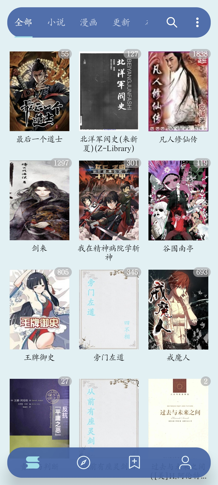
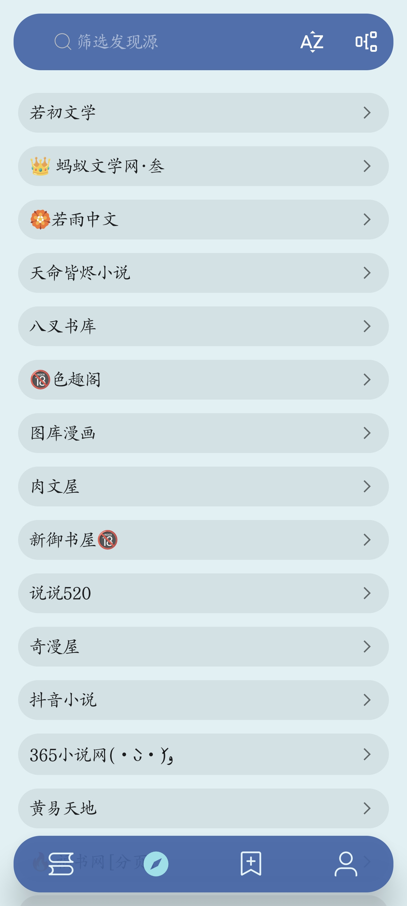
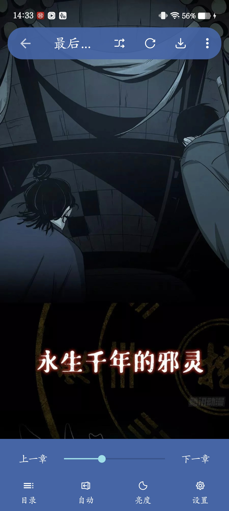
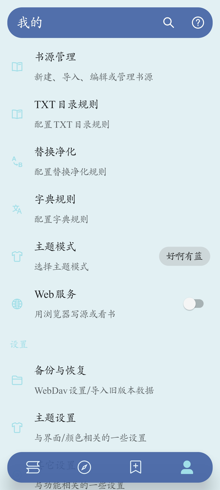
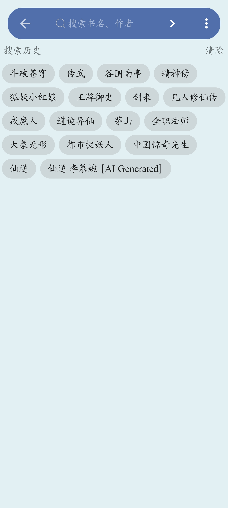

  

<h1 align="center">好啊有</h1>

  一个基于阅读体验深度个性化修改的 Android 阅读应用。

  <a href="https://github.com/iLevody/HaoAyou/releases/latest">下载最新版</a>
  ·
  <a href="https://github.com/iLevody">GitHub 主页</a>

---

## 简介

**好啊有** 是在 Legado / 阅读项目基础上进行个性化调整的版本，主要围绕书架、主题、浮层导航、图标、关于页和整体视觉体验进行了修改。

本项目更偏向个人审美定制，目标是让阅读、管理书籍和浏览内容时拥有更柔和、更沉浸的界面表现。

---

## 应用样图

  
  
  
  
  

  书架 · 主题 · 阅读 · 管理 · 搜索

---

## 当前版本

- 应用名称：好啊有
- 包名：`io.legado.app.ilevody`
- 版本：`5.20.365`
- 最新构建：2026/06/14

---

## 今日主要修改

### 界面与主题

- 新增并优化 **好啊有主题体系**
- 书架顶部栏、底部导航栏改为悬浮浮层样式
- 书籍列表可从顶部栏和底部导航后方穿过滚动
- 优化最后一排书籍与底部浮层的距离
- 优化顶部浮层与页面内容的间距
- 优化多个子页面的浮层视觉一致性

### 主题配色

新增多套好啊有风格主题：

- 好啊有初
- 好啊有白
- 好啊有暗
- 好啊有墨
- 好啊有青
- 好啊有粉
- 好啊有紫
- 好啊有蓝

其中暗色主题已调整为更清晰的暗紫色浮层，避免浮层与背景过于接近。

### 书架管理

- 书架管理页顶部栏恢复主题浮层颜色
- 搜索胶囊加长，可显示更多文字
- 搜索提示格式调整为：`筛选 • 分组`
- 输入搜索时显示清除按钮和提交按钮
- 优化筛选、分组、更多菜单等交互显示

### 关于页面

关于页内容已改为好啊有版本：

> 世事浮沉如赴川流，荣华恰似檐前暮雪。来时赤手无一物，去时难携半分财。半生奔波追浮名，到头来才知，广厦千间，夜眠不过七尺；珍馐美味，日食只须三餐。放下心头万般执念，闲观云卷云舒，方懂平淡才是人间真味。

开发人员信息调整为：

> 好啊有、iLevody 等，详情请在 GitHub 中查看

点击相关内容可跳转至：

https://github.com/iLevody

---

## 下载

请前往 Release 页面下载最新 APK：

https://github.com/iLevody/HaoAyou/releases/latest

---

## 说明

本项目为个人修改版本，主要用于个人学习、研究和使用。

应用内的书源、内容、规则等由用户自行配置和管理，本项目不提供任何书籍内容或版权资源。

---

## 致谢

感谢原项目及相关贡献者：

- gedoor
- Luoyacheng
- Horis
- Xwite
- GEd520
- youfengknight
- Legado / 阅读项目的所有贡献者

也感谢所有开源社区开发者提供的基础能力与灵感。

---

## 开源许可

本项目基于原项目进行修改，相关许可请以原项目及本仓库实际协议文件为准。
